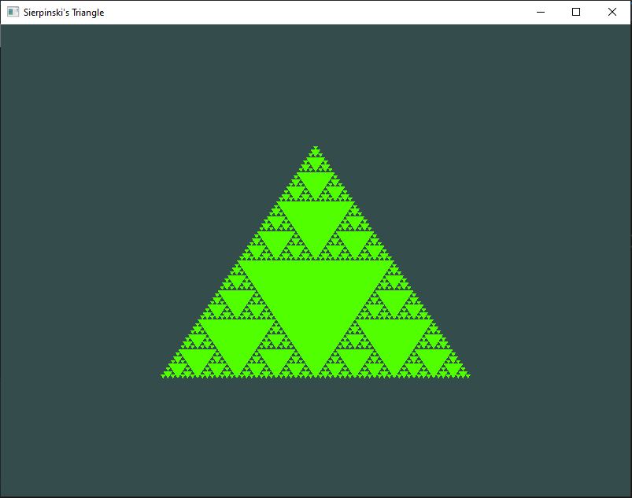

# Sierpinki's Triangle (OpenGL)

This project was a learning experience, my goal was to recreate the ever so famous Sierpinski Triangle using OpenGL's Core Profile.

This algorithm is rather simple:
Given: Points(x, y) A, B, C and Integer N depth
Draw a sierpinski triangle centered around ABC of N depth
```
Sierpinski( A, B, C, N ):
	Draw(mid(A, B), mid(B, C), mid(A, C))
	if (n > 0):
	    Sierpinski(A, mid(A, B), mid(A, C), N - 1)
	    Sierpinski(B, mid(A, B), mid(B, C), N - 1)
	    Sierpinski(C, mid(A, C), mid(B, C), N - 1)
```
The actual program adds some nice RGB and spinning effects which is cool, but for functional results our triangle of depth 5 looks like this:


